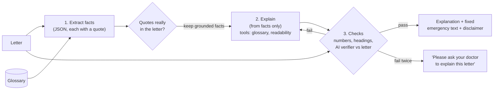

# clearletter

> **Prototype. Not a medical device. Not for clinical use.** No real patient data is used
> anywhere in this project.

Claude turns a medical letter into a faithful, plain-language explanation in the patient's
own language (English, French or Spanish). The core of the project is **safety evaluation**:
showing that the explanation adds nothing, drops nothing and changes nothing.

**Status:** Phases 1–2 of 5 are done (spec, gold-set tool, pipeline). Next: the eval
harness (Phase 3). The full README with results comes in Phase 5.

## How it works



Why it is built this way: [docs/DECISIONS.md](docs/DECISIONS.md).

## Try it

```bash
python3 -m venv .venv && source .venv/bin/activate
pip install -r requirements.txt
cp .env.example .env        # then paste your Anthropic API key into .env
python -m pytest -q         # offline tests: no API key needed, no cost
python run.py data/synthetic/syn_16.txt --lang fr --country uk --model sonnet
```

Each run prints its cost and adds it to `outputs/spend_log.csv`.

## What is in this repository

| Path | What it is |
|------|------------|
| [SPEC.md](SPEC.md) | What the tool must do, and the safety rules it is tested against |
| [DATA.md](DATA.md) | Where every letter comes from, and licences |
| [docs/DECISIONS.md](docs/DECISIONS.md) | Design decisions and the reasons for them |
| `data/synthetic/` | 20 fictional UK letters, each built around a known trap |
| `data/mtsamples/` | 20 public, de-identified US documents from MTSamples |
| `data/glossary.csv` | An open glossary of 90+ medical abbreviations |
| `review.py` | Tool for writing the hand-made "must-keep facts" (the gold set) |
| `clearletter/` | The pipeline: `pipeline.py` (the 3 steps), `prompts.py`, `schemas.py`, `checks.py`, `tools.py`, `fixed_text.py`, `config.py` |
| `run.py` | Explain one letter from the command line |
| `tests/` | Offline tests using a fake Claude |

## Licence

MIT (see [LICENSE](LICENSE)). The MTSamples documents are used for educational purposes with
credit to [mtsamples.com](https://www.mtsamples.com); see [DATA.md](DATA.md).
